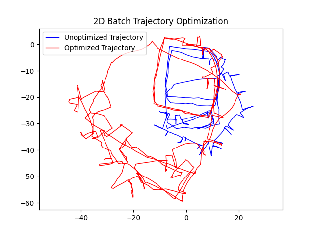
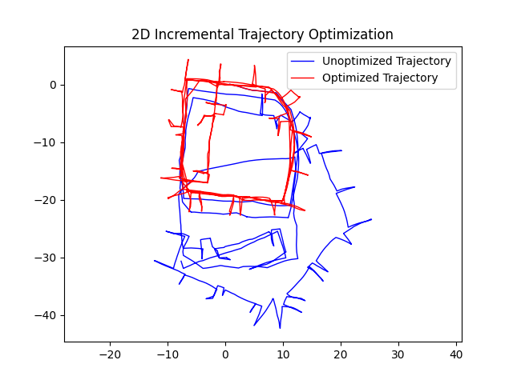
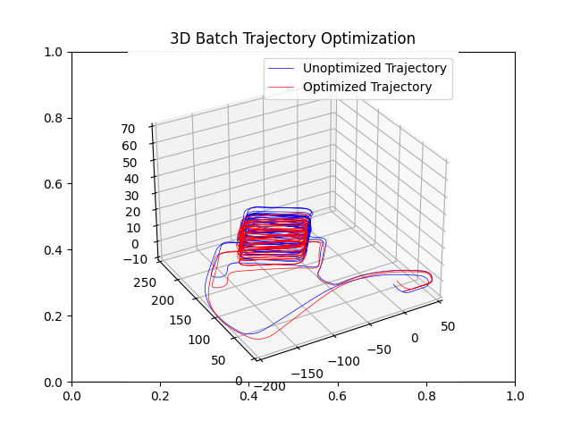
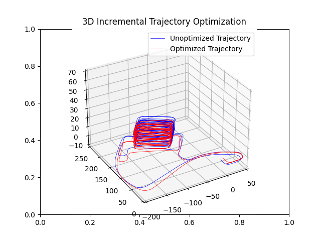
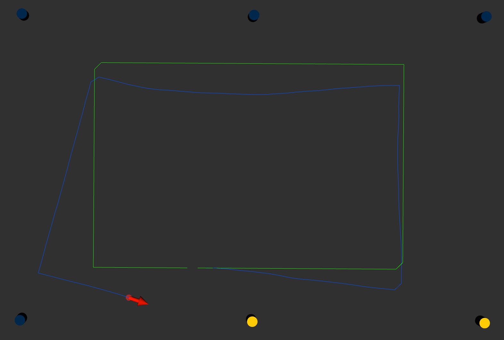

# Mobile Robotics — Methods & Algorithms

A collection of implementations from a graduate **Mobile Robotics: Methods & Algorithms** course
(University of Michigan, NA 568 / ROB 530). The repository covers the core state-estimation
pipeline of a mobile robot: **Bayesian filtering**, **occupancy grid mapping**,
**recursive localization filters** (EKF, UKF, PF, InEKF), and **factor-graph SLAM** with
[GTSAM](https://gtsam.org/).

Each module is self-contained and includes the driver code, sample datasets, and the figures
produced by the implementations.

---

## Contents

| Module | Topic | Key techniques | Language / Stack |
|--------|-------|----------------|------------------|
| [`SLAM_with_GTSAM`](#slam-with-gtsam) | 2D & 3D pose-graph SLAM | Batch (Gauss-Newton) & incremental (iSAM2) optimization | Python + GTSAM |
| [`hw2-code`](#hw2--kalman-filtering) | Kalman filtering | Covariance propagation, maximum-likelihood estimation | Python / Julia / MATLAB |
| [`hw4-code`](#hw4--occupancy-grid-mapping) | Occupancy grid mapping | Counting Sensor Model + continuous & semantic variants | Python |
| [`hw5-code`](#hw5--recursive-localization-filters) | Robot localization | EKF, UKF, PF, Right-Invariant EKF on SE(2) | Python + ROS |
| [`hw7-code`](#hw7--pose-graph-slam-data) | Pose-graph SLAM (INTEL) | g2o dataset + GTSAM entry point | Python + GTSAM |
| [`recitation`](#recitations) | Fundamentals | Bayes filter, rigid-body transforms, camera geometry | Jupyter |

---

## SLAM with GTSAM

Pose-graph SLAM solved as a nonlinear least-squares problem over a factor graph. The trajectory
is estimated in two ways and compared:

- **Batch** — the full graph is optimized in one shot with **Gauss-Newton**.
- **Incremental** — poses and constraints are added one timestep at a time and re-solved with
  **iSAM2** (`gtsam.ISAM2`), which is what an online SLAM system would use.

Both a **2D (SE(2))** and a **3D (SE(3))** version are implemented, including a custom g2o parser,
a prior factor to anchor the graph, `BetweenFactor` constraints built from the edge information
matrices, and plotting of the initial vs. optimized trajectory.

**Files**

| File | Description |
|------|-------------|
| `2D_batch_incremental.py` | 2D SLAM — batch + incremental solutions and plots |
| `3D_batch_incremental.py` | 3D SLAM — batch + incremental, with quaternion → rotation-matrix conversion |
| `input_INTEL_g2o.g2o` | 2D dataset (Intel Research Lab) |
| `parking-garage.g2o` | 3D dataset (parking garage) |
| `README.md` | Detailed write-up of the batch/incremental derivations |

**Run**

```bash
cd SLAM_with_GTSAM
python 2D_batch_incremental.py      # 2D SLAM on input_INTEL_g2o.g2o
python 3D_batch_incremental.py      # 3D SLAM on parking-garage.g2o
```

**Results**

| 2D — Batch | 2D — Incremental |
|:---:|:---:|
|  |  |

| 3D — Batch | 3D — Incremental |
|:---:|:---:|
|  |  |

---

## hw2 — Kalman Filtering

Foundations of Gaussian estimation, implemented in parallel in **Python** and **Julia**.

- **Task 4 — First-order covariance propagation.** A robot at the origin observes a landmark
  in (range, bearing) with small range noise but large bearing noise. The task linearizes the
  polar-to-Cartesian transform and studies the error introduced by that linearization when
  propagating the covariance into the `(x, y)` position estimate.
- **Task 5 — Estimation.** Likelihood and maximum-likelihood estimation of an unknown parameter
  from noisy observations.

MATLAB helpers (`calculateEllipseXY.m`, `draw_ellipse.m`) draw the uncertainty ellipses.

**Files**

```
hw2-code/
├── task4_python.ipynb / task4_julia.ipynb   # covariance propagation
├── task5_python.ipynb / task5_julia.ipynb   # MLE estimation
└── matlab/                                   # ellipse-drawing utilities
```

Open the notebooks with Jupyter (`jupyter notebook`) or an IJulia kernel for the `.jl` versions.

---

## hw4 — Occupancy Grid Mapping

Builds a 2D occupancy grid map of the **Intel Research Lab** dataset from robot poses and laser
scans, using a KD-tree over grid centroids and four increasingly expressive sensor models:

1. **CSM** — Counting Sensor Model (`ogm_CSM.py`)
2. **Continuous CSM** — kernel-smoothed / continuous counting model (`ogm_continuous_CSM.py`)
3. **S-CSM** — Semantic CSM, mapping semantic class labels (`ogm_S_CSM.py`)
4. **Continuous S-CSM** — continuous + semantic (`ogm_continous_S_CSM.py`)

Each model produces an occupancy **mean** map and a **variance** map.

**Run**

```bash
cd hw4-code
python run.py --task_num 1      # CSM
python run.py --task_num 2      # Continuous CSM
python run.py --task_num 3      # S-CSM (semantic)
python run.py --task_num 4      # Continuous S-CSM
```

**Data:** `data/sample_Intel_dataset.mat`, `data/sample_Intel_dataset_semantic.mat`.
Output figures (`ogm_intel_*_mean.png`, `ogm_intel_*_variance.png`) are generated on each run.

---

## hw5 — Recursive Localization Filters

2D landmark-based robot localization implemented over a common ROS/`RobotState` framework, so the
four filters can be swapped and compared on the same motion/measurement model. The robot follows a
noisy odometry command and corrects its belief against two observed landmarks each step.

Implemented filters (in `filter/`):

- **EKF** — Extended Kalman Filter
- **UKF** — Unscented Kalman Filter
- **PF** — Particle Filter
- **InEKF** — Right-Invariant EKF on the SE(2) Lie group

Results are visualized live in **rviz**: the green path is the noise-free command path, the blue
path is the true (noisy) trajectory, and the red ellipse/arrow show the filter's estimate and
covariance.



**Setup & run**

Requires **Ubuntu 20.04 + ROS Noetic** and Python 3 with NumPy, SciPy, PyYAML, and Matplotlib.

```bash
cd hw5-code/HW5_codes_python

# 1. select the filter in config/settings.yaml  ->  filter_name: EKF | UKF | PF | InEKF | test
# 2. start ROS
roscore

# 3. in a new terminal, open the visualizer and load rviz/default.rviz
rviz

# 4. in a new terminal, run the estimator
python3 run.py
```

Set `filter_name: test` first to verify the environment with the provided dummy filter.
See `hw5-code/HW5_codes_python/README.md` for full installation notes.

---

## hw7 — Pose-Graph SLAM (data)

Contains the 2D **INTEL** g2o dataset (`input_INTEL_g2o.g2o`) and a GTSAM entry point
(`slam.py`). The full, worked implementation of pose-graph SLAM on this dataset lives in
[`SLAM_with_GTSAM`](#slam-with-gtsam).

---

## Recitations

Supporting notebooks that build up the theory used across the assignments:

- **Recitation 1** — the **Bayes filter**: recursive belief update from actions and measurements.
- **Recitation 2** — **PF and EKF** applied to estimating the 3D position of a stationary object
  from two fixed monocular cameras (pinhole projection, triangulation, filtering).
- **Recitation 3** — **rigid-body transformations** and rotation matrices on SO(3).

---

## Dependencies

Most modules run on Python 3 with the scientific stack:

```bash
pip install numpy scipy matplotlib pyyaml tqdm gtsam
```

Additional, module-specific requirements:

- **hw5** — ROS Noetic (Ubuntu 20.04) for the localization visualization.
- **hw2** — Jupyter, and optionally Julia + IJulia for the `.jl` notebooks; MATLAB for the
  ellipse helpers.
- **SLAM_with_GTSAM / hw7** — [GTSAM](https://github.com/borglab/gtsam) Python bindings
  (`pip install gtsam`).

---

## Repository layout

```
Mobile_robot/
├── SLAM_with_GTSAM/     # 2D & 3D pose-graph SLAM (batch + iSAM2)
├── hw2-code/            # Kalman filtering: covariance propagation, MLE
├── hw4-code/            # Occupancy grid mapping (CSM variants)
├── hw5-code/            # EKF / UKF / PF / InEKF localization (ROS)
├── hw7-code/            # INTEL g2o dataset + GTSAM SLAM entry point
└── recitation/          # Bayes filter, transforms, camera geometry
```
